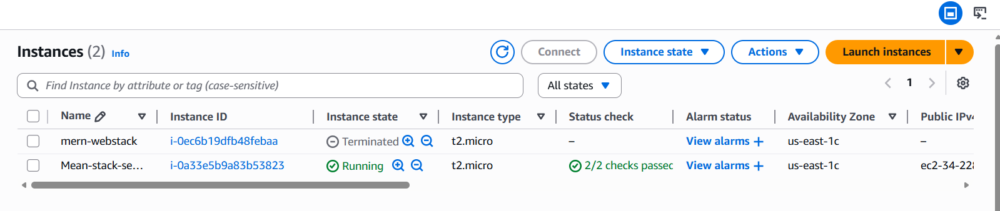
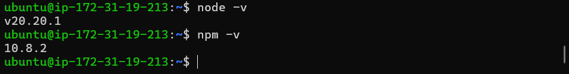
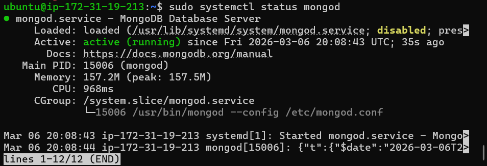
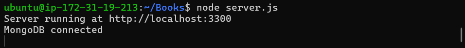
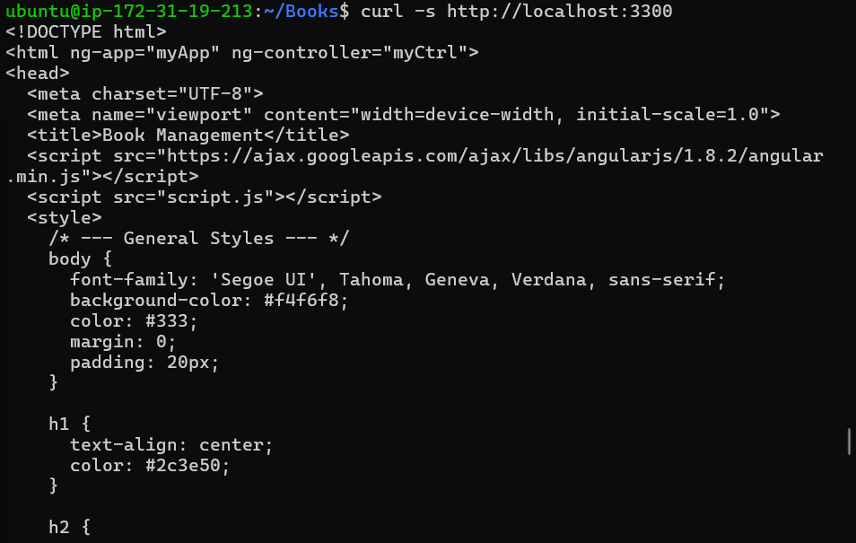
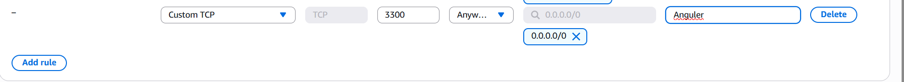
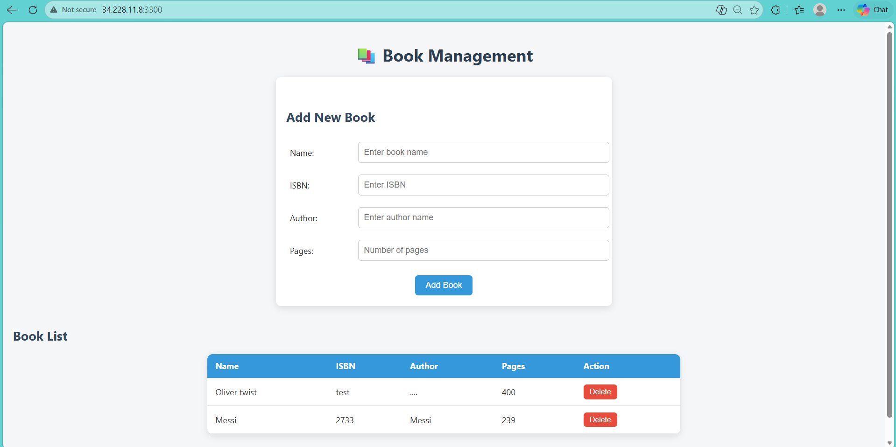

# WEB STACK IMPLEMENTATION (MEAN STACK) IN AWS

## 📌 Project Overview

This project demonstrates deploying a **MEAN Stack** (MongoDB, Express.js, AngularJS, Node.js) application on an **AWS EC2 Ubuntu Server**.

The components used:

* **MongoDB** → NoSQL document database
* **ExpressJS** → Backend framework for Node.js
* **AngularJS** → Frontend framework for dynamic views
* **Node.js** → JavaScript runtime environment

The application built is a **Book Management Web Application** that allows users to:

* 📖 Add books
* 📖 View all books
* 📖 Delete books

---

## ☁️ AWS Environment Setup

### Step 0 — Preparing Prerequisites

* EC2 instance running **Ubuntu Server 24.04 LTS**
* Instance type: `t2.micro`



Connect to your EC2 instance:

```bash
ssh -i <Your-private-key.pem> ubuntu@<EC2-Public-IP>
```

Update Ubuntu:

```bash
sudo apt update
sudo apt upgrade -y
```

---

# 🟢 Step 1 — Install Node.js (v20)

Add NodeSource repository for Node.js 20:

```bash
curl -fsSL https://deb.nodesource.com/setup_20.x | sudo -E bash -
```

Install Node.js:

```bash
sudo apt install -y nodejs
```

Verify installation:

```bash
node -v   # Should show v20.x.x
npm -v
```



---

# 📁 Step 2 — Install MongoDB (v7)

Add MongoDB GPG key and repository:

```bash
sudo apt-get install -y gnupg curl
curl -fsSL https://www.mongodb.org/static/pgp/server-7.0.asc | sudo gpg -o /usr/share/keyrings/mongodb-server-7.0.gpg --dearmor
echo "deb [ arch=amd64,arm64 signed-by=/usr/share/keyrings/mongodb-server-7.0.gpg ] https://repo.mongodb.org/apt/ubuntu jammy/mongodb-org/7.0 multiverse" | sudo tee /etc/apt/sources.list.d/mongodb-org-7.0.list
```

Install MongoDB:

```bash
sudo apt-get update
sudo apt-get install -y mongodb-org
```

Start MongoDB server:

```bash
sudo service mongod start
```

Verify MongoDB is running:

```bash
sudo systemctl status mongod
```



---

# 📦 Step 3 — Project Setup

Create a project folder:

```bash
mkdir Books
cd Books
```

Initialize npm:

```bash
npm init -y
```

Install required packages:

```bash
npm install express mongoose body-parser
```

---

# 🚀 Step 4 — Server Configuration

Create `server.js` file in the root `Books` folder:

```javascript
// server.js
const express = require('express');
const mongoose = require('mongoose');
const path = require('path');

const app = express();
const PORT = process.env.PORT || 3300;

// MongoDB connection
mongoose.connect('mongodb://localhost:27017/test')
  .then(() => console.log('MongoDB connected'))
  .catch(err => console.error('MongoDB connection error:', err));

// Middleware
app.use(express.json()); // replaces body-parser
app.use(express.static(path.join(__dirname, 'public'))); // serve AngularJS frontend

// Routes
require('./apps/routes')(app);

// Start server
app.listen(PORT, () => {
  console.log(`Server running at http://localhost:${PORT}`);
});
```

Start the server:

```bash
node server.js
```



---

# 🛣 Step 5 — Create Routes

Create a folder `apps`:

```bash
mkdir apps
cd apps
```

Create `routes.js`:

```javascript
// apps/routes.js
const Book = require('./models/book');
const path = require('path');

module.exports = function(app) {

  // Get all books
  app.get('/book', async (req, res) => {
    try {
      const books = await Book.find();
      res.json(books);
    } catch (err) {
      res.status(500).json({ message: 'Error fetching books', error: err.message });
    }
  });

  // Add a book
  app.post('/book', async (req, res) => {
    try {
      const book = new Book({
        name: req.body.name,
        isbn: req.body.isbn,
        author: req.body.author,
        pages: req.body.pages
      });
      const savedBook = await book.save();
      res.status(201).json({ message: 'Successfully added book', book: savedBook });
    } catch (err) {
      res.status(400).json({ message: 'Error adding book', error: err.message });
    }
  });

  // Delete a book
  app.delete('/book/:isbn', async (req, res) => {
    try {
      const result = await Book.findOneAndDelete({ isbn: req.params.isbn });
      if (!result) return res.status(404).json({ message: 'Book not found' });
      res.json({ message: 'Successfully deleted the book', book: result });
    } catch (err) {
      res.status(500).json({ message: 'Error deleting book', error: err.message });
    }
  });

  // Serve AngularJS index
  app.get('*', (req, res) => {
    res.sendFile(path.join(__dirname, '../public', 'index.html'));
  });

};
```

---

# 🧠 Step 6 — Create Book Model

Inside `apps/models/book.js`:

```javascript
// apps/models/book.js
const mongoose = require('mongoose');

const bookSchema = new mongoose.Schema({
  name: { type: String, required: true },
  isbn: { type: String, required: true, unique: true, index: true },
  author: { type: String, required: true },
  pages: { type: Number, required: true, min: 1 }
}, { timestamps: true });

module.exports = mongoose.model('Book', bookSchema);
```

---

# 🔄 Step 7 — Frontend Setup (AngularJS)

Create a `public` folder and add files:

```bash
mkdir public
cd public
```

### `script.js`

```javascript
angular.module('myApp', [])
.controller('myCtrl', function($scope, $http) {
  function fetchBooks() {
    $http.get('/book')
      .then(response => { $scope.books = response.data; })
      .catch(error => console.error('Error fetching books:', error));
  }
  fetchBooks();

  $scope.del_book = function(book) {
    $http.delete(`/book/${book.isbn}`)
      .then(() => fetchBooks())
      .catch(error => console.error('Error deleting book:', error));
  };

  $scope.add_book = function() {
    const newBook = {
      name: $scope.Name,
      isbn: $scope.Isbn,
      author: $scope.Author,
      pages: $scope.Pages
    };
    $http.post('/book', newBook)
      .then(() => {
        fetchBooks();
        $scope.Name = $scope.Isbn = $scope.Author = $scope.Pages = '';
      })
      .catch(error => console.error('Error adding book:', error));
  };
});
```

### `index.html` (Updated & Styled)

```html
<!DOCTYPE html>
<html ng-app="myApp" ng-controller="myCtrl">
<head>
  <meta charset="UTF-8">
  <meta name="viewport" content="width=device-width, initial-scale=1.0">
  <title>Book Management</title>
  <script src="https://ajax.googleapis.com/ajax/libs/angularjs/1.8.2/angular.min.js"></script>
  <script src="script.js"></script>
  <style>
    body { font-family: 'Segoe UI', sans-serif; background: #f4f6f8; margin: 0; padding: 20px; color:#333; }
    h1 { text-align:center; color:#2c3e50; }
    h2 { margin-top:40px; color:#34495e; }
    .form-card { background:#fff; padding:20px; border-radius:10px; box-shadow:0 4px 12px rgba(0,0,0,0.1); max-width:600px; margin:0 auto 40px; }
    input[type=text], input[type=number] { width:100%; padding:10px; border-radius:6px; border:1px solid #ccc; font-size:16px; }
    button { background:#3498db; color:white; border:none; border-radius:6px; padding:10px 20px; cursor:pointer; transition:0.3s; }
    button:hover { background:#2980b9; }
    .book-table { width:100%; max-width:900px; margin:0 auto 50px; border-collapse:collapse; background:#fff; border-radius:10px; box-shadow:0 4px 12px rgba(0,0,0,0.1); overflow:hidden; }
    .book-table th { background:#3498db; color:white; padding:12px 15px; }
    .book-table td { padding:12px 15px; border-bottom:1px solid #e0e0e0; }
    .book-table tr:hover { background:#f1f7fc; }
    .delete-btn { background:#e74c3c; padding:6px 12px; font-size:14px; }
    .delete-btn:hover { background:#c0392b; }
    @media(max-width:768px){ .form-card, .book-table{width:95%;} .book-table th, .book-table td{font-size:14px;padding:8px;} button{font-size:14px;padding:8px 16px;} }
  </style>
</head>
<body>
  <h1>📚 Book Management</h1>
  <div class="form-card">
    <h2>Add New Book</h2>
    <form ng-submit="add_book()">
      <table>
        <tr><td>Name:</td><td><input type="text" ng-model="Name" placeholder="Enter book name" required></td></tr>
        <tr><td>ISBN:</td><td><input type="text" ng-model="Isbn" placeholder="Enter ISBN" required></td></tr>
        <tr><td>Author:</td><td><input type="text" ng-model="Author" placeholder="Enter author name" required></td></tr>
        <tr><td>Pages:</td><td><input type="number" ng-model="Pages" placeholder="Number of pages" required></td></tr>
      </table>
      <div style="text-align:center;margin-top:15px;"><button type="submit">Add Book</button></div>
    </form>
  </div>
  <h2>Book List</h2>
  <table class="book-table">
    <thead><tr><th>Name</th><th>ISBN</th><th>Author</th><th>Pages</th><th>Action</th></tr></thead>
    <tbody>
      <tr ng-repeat="book in books"><td>{{book.name}}</td><td>{{book.isbn}}</td><td>{{book.author}}</td><td>{{book.pages}}</td><td><button class="delete-btn" ng-click="del_book(book)">Delete</button></td></tr>
      <tr ng-if="books.length===0"><td colspan="5" style="text-align:center;padding:20px;">No books available.</td></tr>
    </tbody>
  </table>
</body>
</html>
```
---
Perfect! I can add a new section in your README explaining how to run the Node.js server in the background using `&`, and also a tip about `nohup` for long-running background processes on AWS. Here’s how it would look:

---

## 🟢Run Server in Background

While developing, you might want your **Node.js server** to keep running even after you close the terminal or SSH session. There are two common ways to do this:

### Using `&` to run in background

This will run the server in the background of your current terminal session:

```bash
node server.js &
```

* The `&` symbol tells Linux to run the process in the background.
* After running, you’ll see a **process ID (PID)** printed.
* To see background jobs:

```bash
jobs
```

* To bring it back to the foreground:

```bash
fg %1
```
---

---

---

# 🔄 Step 8 — Open Port 3300 in Security Group

Add inbound rule for:

* Type: Custom TCP
* Port: 3300
* Source: 0.0.0.0/0



Test in browser:

```
http://<Public-IP>:3300
```



---

# ✅ Project Complete

Your **MEAN stack application** is fully operational:

* ☑ Ubuntu Server 24.04 LTS
* ☑ Node.js v20 Backend
* ☑ Express RESTful API
* ☑ MongoDB v7 Database
* ☑ AngularJS Frontend
* ☑ Full CRUD Operations

---

# 👨‍💻 Author

**Marco Raafat Zakaria**
Steghub Scholarship
Faculty of Computers & Artificial Intelligence – Cairo University

---
